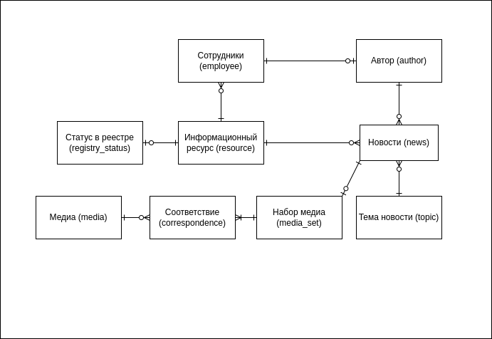
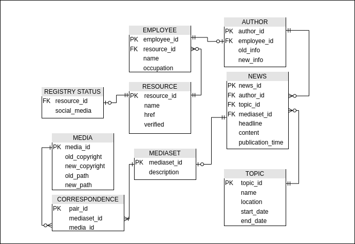
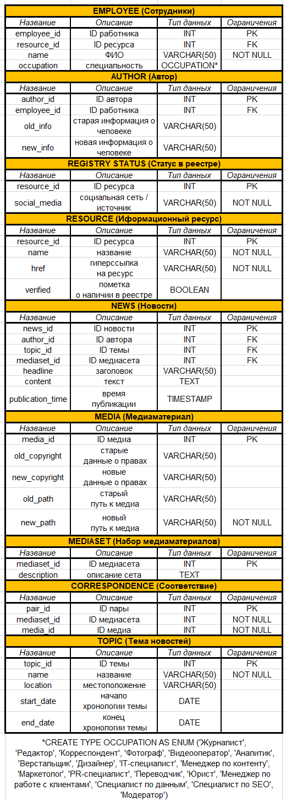
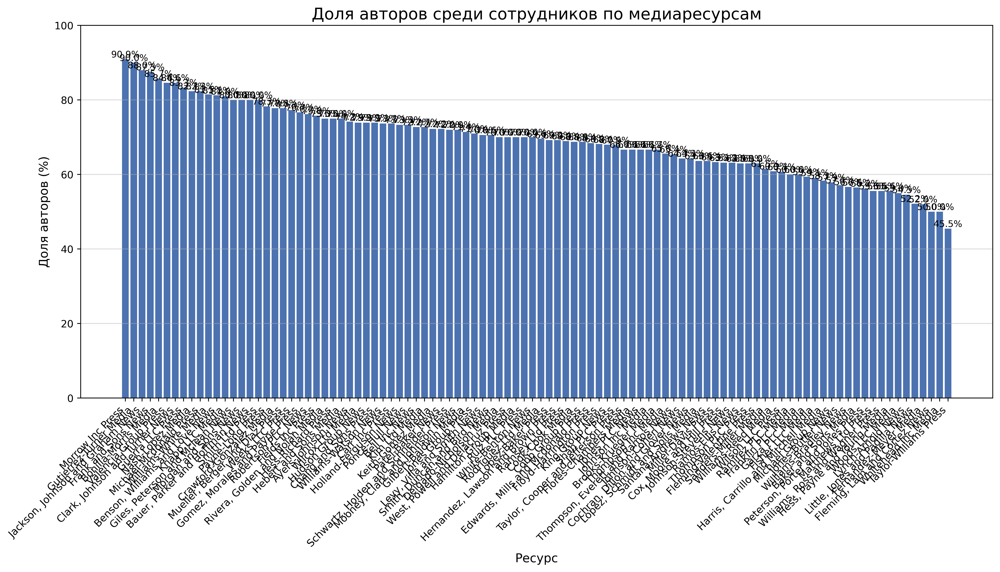
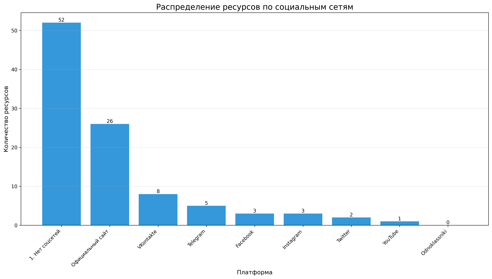
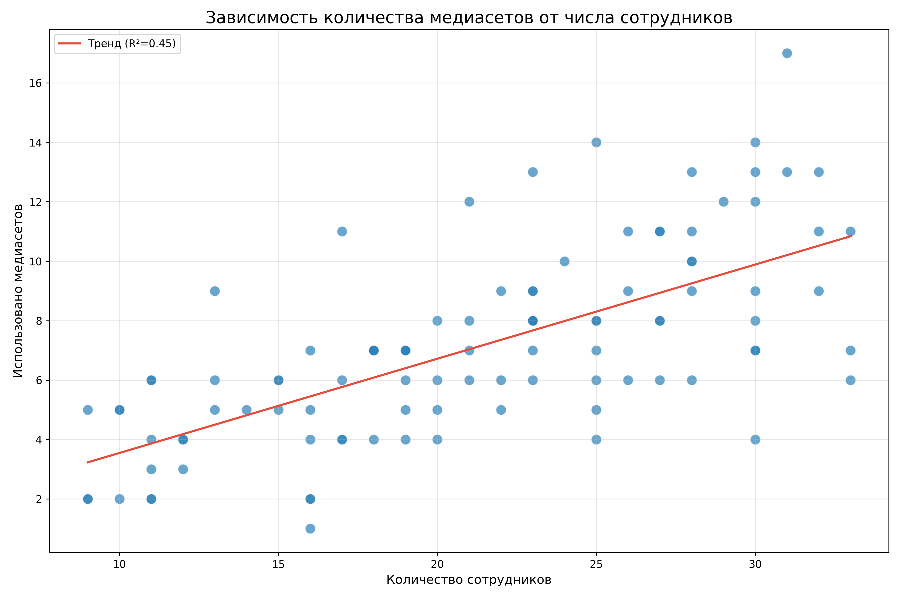

# База данных новостей

Проект представляет собой разветвленную систему для хранения данных о новостях, связанных с ними информационных ресурсах, авторах, медиа и прочем.
#### Концептуальная модель

#### Логическая модель

#### Физическая модель

## Описание базы данных
Первичной является таблица resources. Она описывает информационные ресурсы с названиями и гиперссылками. Флаг verified указывает на наличие ресурса в реестре. Employee содержит информацию о сотрудниках ресурсов, ФИО и род деятельности. Author ссылается на employee, содержит характеристику авторов статей. Registry_status непосредственно фиксирует записи о социальных сетях. В topic запечатлены название, локация, интервал для тем новостей. Media хранит копирайты и пути в SCD3. Mediaset хранит наборы медиа для новостей, correspondence регулирует соответствие между ними. News содержит исчерпывающую информацию о новостях.
## Анализ результатов
### Гипотеза 1
#### _В среднем, 70% сотрудников каждого информ. ресурса являются авторами статей._
Это обусловлено важностью роли автора для работы ресурса.
Для полученной выборки:\
Среднее значение: 69.21%\
Стандартное отклонение: 9.68%\
Минимальное значение: 45.45%\
Максимальное значение: 90.91%\

### Гипотеза 2
#### _Доминирующем форматом СМИ является официальный сайт._
Это обусловлено удобством и гибкостью формата, возможности создания более сложных интерфейсов и интеракций, чем возможно в социальных сетях.

### Гипотеза 3
#### _Количество сотрудников в компании и разнообразие используемых медиаресурсов коррелируют._
Это обусловлено мощностью работы сотрудников как большой команды и обработкой бОльшего количества материалов.

